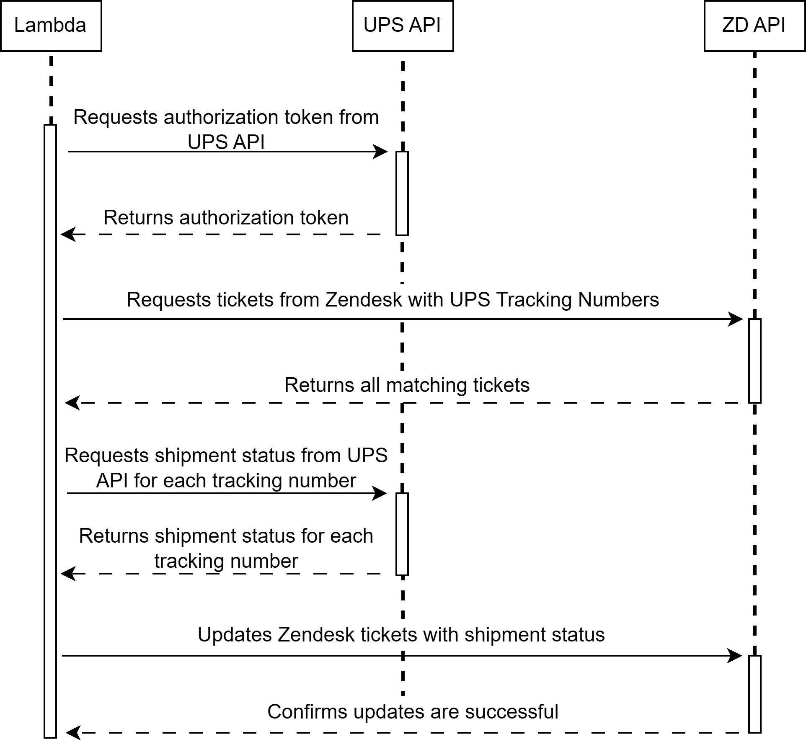
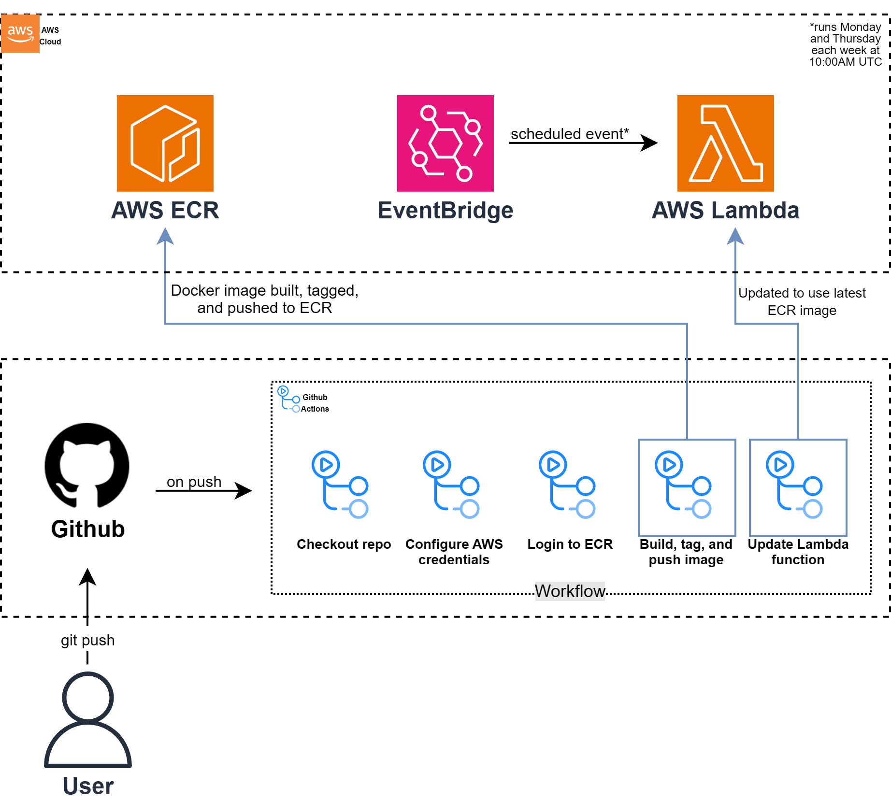

# Zendesk UPS Tracking Tool

The Zendesk UPS Tracking Tool is a custom integration that streamlines the process of tracking UPS shipments directly within Zendesk. This tool enables support agents to quickly access and share tracking information with customers, enhancing efficiency and customer satisfaction.

## Overview

The tool uses AWS Lambda, AWS EventBridge, and the UPS/Zendesk APIs to automate fetching and updating shipment tracking information in Zendesk tickets.

### How It Works

1. **Custom Field in Zendesk**:
    - A custom field in Zendesk stores UPS tracking numbers.

2. **Scheduled Lambda Execution**:
    - An AWS Lambda function, triggered by AWS EventBridge cron jobs, runs at regular intervals.
    - The function queries Zendesk for tickets containing UPS tracking numbers.

3. **Fetching Tracking Information**:
    - The Lambda function retrieves the latest tracking status for each number from the UPS API.

4. **Updating Zendesk Tickets**:
    - The retrieved tracking information is updated in the corresponding Zendesk tickets.
    - Agents can view the latest tracking status without the need of manual lookup.

### Sequence Diagram

The sequence diagram below illustrates the interaction between AWS Lambda, UPS API, and Zendesk API:

1. **Lambda** requests an authorization token from the UPS API.
2. **UPS API** returns the token.
3. **Lambda** requests tickets from Zendesk with UPS tracking numbers.
4. **Zendesk API** returns matching tickets.
5. **Lambda** requests shipment status from the UPS API for each tracking number.
6. **UPS API** returns shipment status.
7. **Lambda** updates Zendesk tickets with the shipment status.
8. **Zendesk API** confirms successful updates.

### CI/CD Pipeline

The CI/CD pipeline automates the deployment process using GitHub Actions and AWS services:

1. **GitHub Actions**: Automates building, tagging, and pushing Docker images to AWS ECR upon code changes.
2. **AWS ECR**: Stores Docker images.
3. **AWS EventBridge**: Triggers the Lambda function on a schedule.
4. **AWS Lambda**: Executes the code to fetch and update tracking information in Zendesk.